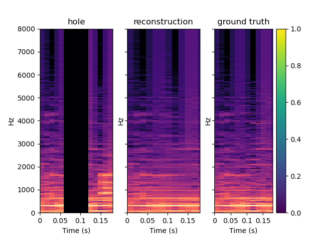
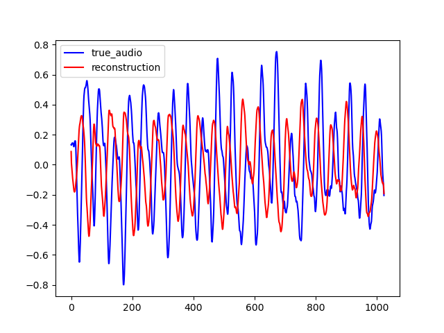
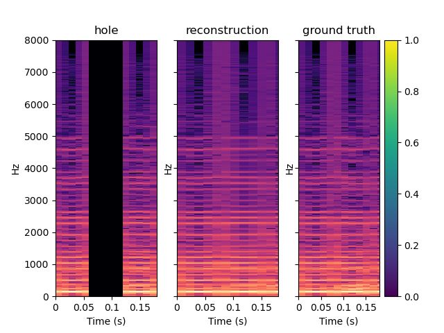
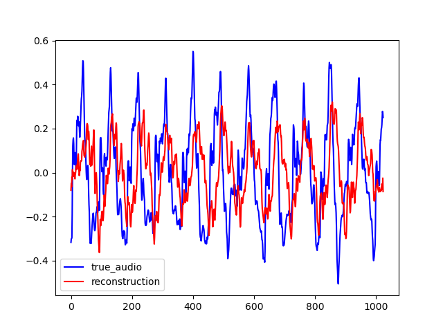

## Inpainting an prediction GAN for audio
IGAN, InpaintingGAN is a neural network to inpaint magnitude spectrum. It can be trained to inpaint the magnitude spectrum of an audio frame of length T second, given the previous and subsequent T seconds. PGAN, PredicitonGAN is an adaptation of IGAN to perform audio prediction. It can be trained to predict an audio frame of T second, given the T previous second. This webpage accompaing the [github repository](https://github.com/ced211/master_thesis.git).

### IGAN

Here are some sample output by IGAN for T=0.064. To reconstruct the audio from the magnitude spectrum, the Griffin-Lim algorithm was used. As you can see on the various examples, the reconstructed spectrum is rather good, but blurrred. On the other hand, the audio waveforms look similar to the ground truth even if thay are not close from them. This is explained by the fact that the Griffin-Lim does not output the exact waveform, even if it is fed with the real magnitude. Moreover, it works from an approximation of the real magnitude spectrum.

On the example below, one can see the spectrum outputs by IGAN and the corresponding waveform obtained with an extra Griffin-Lim step. To obtain this result, IGAN was trained for 200 epochs on the small FMA dataset. The network performence can be probably improved by letting it train longer. 

<table>
  <tr>
    <th> 
    <th> 
  </tr>
  <tr>
    <th> 
    <th> 
  </tr>
  <tr>
    <th> 
    <th> 
  </tr>
</table>
|  |  |
|---|---|
|  |  |
|---|---|
|  | |
|---|---|

Here, you can heard the corresponding audio: [original audio](/Samples/batch_2_or_sample_59.wav), [reconstructed audio](/Samples/batch_2_rec_sample_59.wav).


<audio controls>
  <source src="/Samples/batch_0_or_sample_174.wav" type="audio/wav">
Your browser does not support the audio element.
</audio> 

```markdown
Syntax highlighted code block

# Header 1
## Header 2
### Header 3

- Bulleted
- List

1. Numbered
2. List

**Bold** and _Italic_ and `Code` text

[Link](url) and 
```

For more details see [GitHub Flavored Markdown](https://guides.github.com/features/mastering-markdown/).

### Jekyll Themes

Your Pages site will use the layout and styles from the Jekyll theme you have selected in your [repository settings](https://github.com/ced211/ced211.github.io/settings). The name of this theme is saved in the Jekyll `_config.yml` configuration file.

### Support or Contact

Having trouble with Pages? Check out our [documentation](https://help.github.com/categories/github-pages-basics/) or [contact support](https://github.com/contact) and we’ll help you sort it out.

* Item 1
* Item 2
  * Item 2a
  * Item 2b
